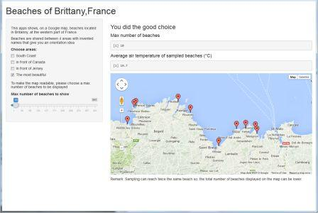

## Myproject uses French tourism open data to show 

1. A sample of beaches among 341 references 
2. These beaches location on a Google map
3. Average temperature of the sample

## Source

"Beaches of Brittany" is a simple open data produced by offices of tourism.

source URL: http://www.data-tourisme-bretagne.com/web/guest/data

For the demo, "invented" air temperature per beach, in celsius degrees, has been added.

Further agreement with institutions will be needed to collect more open real data.

--- .class #id 

## Inputs

Sampling is possible in 2 ways:

<h3> 1.Selecting one or several areas of Britanny </h3>

Areas names are not official but they are quite easy to understand.

<h3> 2. Giving a number of samples among the selected areas</h3>

That helps for visibility on the map and can be useful for further experience.

--- .class #id 

## Outputs

<h3> 1. A Google map enables easy visualization of beaches </h3> 

Each tip designates the town where beach is located. Some lucky towns have several beaches.

<h3> 2. The average air temperature of the samples given in Celsius degrees </h3>

<br>


--- .class #id 

## Next steps !
Richer open data can definitely provide useful statistics for sea and tourism professionals.
For ex., we could imagine correlation between the number of cars parked around beaches and temperatures per area. 


```{r echo = F, results = 'asis'}
require(rCharts)

# extra ordered data for slides (temperature, number of cars parked there, per areas)
extradata <- read.csv("extradata.csv", sep=";")
newdata <- extradata[order(extradata$TEMP),]

myplot <- nPlot(NBCAR ~ TEMP, group = 'AREA', type = 'multiBarChart', data = newdata)
myplot$chart(reduceXTicks = FALSE, showControls=FALSE)
myplot$xAxis(axisLabel = "Temperature (Celsius degrees)")
myplot$print('extraPlot')

```

<h3 align="center"> Have fun and let's progress! </h3>
